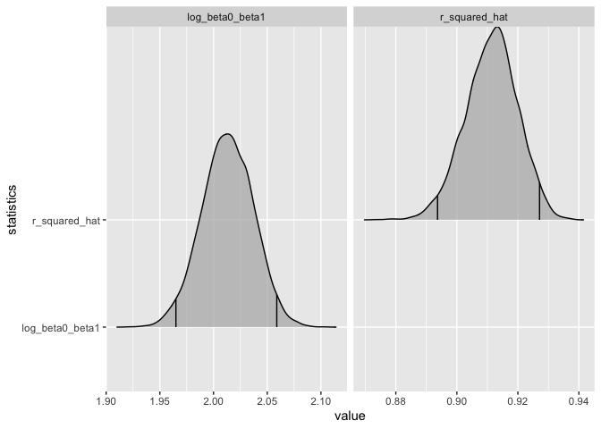
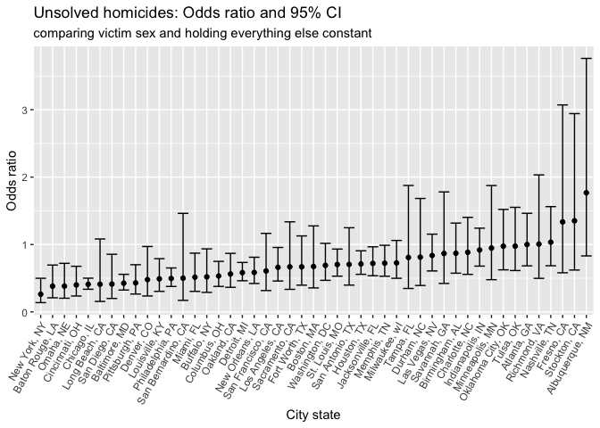
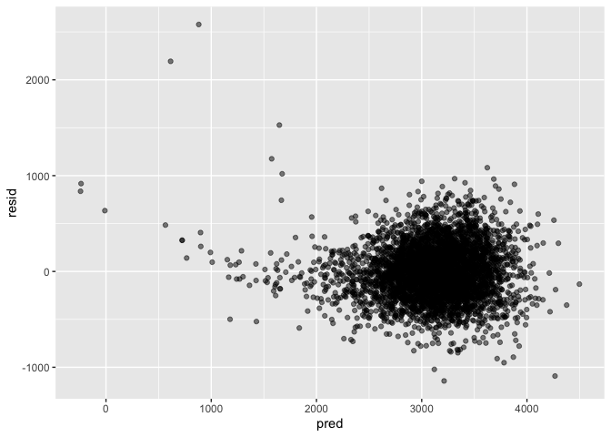
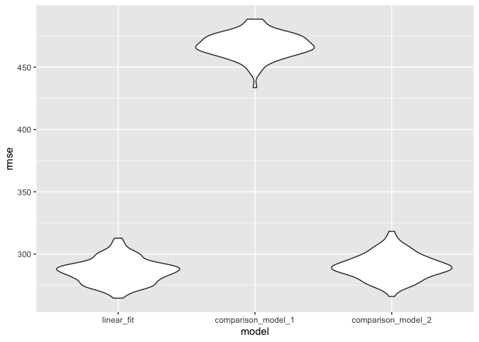

p8105 HW6
================
Yijin Serena Wang
2022-12-01

``` r
library(tidyverse)
library(rnoaa)
library(readr)
library(ggplot2)
library(modelr)
library(broom)
library(ggridges)
library(janitor)
library(mgcv)
```

## Problem 1

Download and clean data

``` r
weather_df = 
  rnoaa::meteo_pull_monitors(
    c("USW00094728"),
    var = c("PRCP", "TMIN", "TMAX"), 
    date_min = "2017-01-01",
    date_max = "2017-12-31") %>%
  mutate(
    name = recode(id, USW00094728 = "CentralPark_NY"),
    tmin = tmin / 10,
    tmax = tmax / 10) %>%
  select(name, id, everything())
```

    ## using cached file: ~/Library/Caches/R/noaa_ghcnd/USW00094728.dly

    ## date created (size, mb): 2022-11-27 14:56:44 (8.426)

    ## file min/max dates: 1869-01-01 / 2022-11-30

Create a function to extract r squared from linear model output

``` r
get_r_squared_hat <- function(model) {
  model %>% 
    glance() %>%
    pull(r.squared)
}
```

Create a function to extract beta0/intercept from linear model output

``` r
get_beta_0 <- function(model) {
 model %>%
    tidy() %>%
    filter(term == "(Intercept)") %>%
    pull(estimate)
    
}
```

Create a function to extract beta1/coef for tmin from linear model
output

``` r
get_beta_1 <- function(model) {
 model %>%
    tidy() %>%
    filter(term != "(Intercept)") %>%
    pull(estimate)
  }
```

Create 5000 bootstrap samples. For each sample, build a linear model
then extract results.

``` r
set.seed(1)
weather_sim_lm_result <- weather_df %>% 
  modelr::bootstrap(n = 5000) %>% 
  mutate(
    models = map(strap, ~lm(tmax ~ tmin, data = .x)),
    r_squared_hat = map(models, get_r_squared_hat),
    beta_0 = map(models, get_beta_0),
    beta_1 = map(models, get_beta_1)) %>%
  select(r_squared_hat, beta_0, beta_1) %>%
  mutate(across(everything(), as.numeric)) %>%
  mutate(log_beta0_beta1 = log(beta_0 * beta_1))
```

Plot model results

``` r
weather_sim_lm_result %>%
  pivot_longer(cols=c("r_squared_hat",
                      "log_beta0_beta1"), 
                      names_to = "statistics") %>%
  ggplot() +
  stat_density_ridges(
    aes(x = value, y = statistics),
    quantile_lines = TRUE, 
    quantiles = c(0.025, 0.975), 
    alpha = 0.7) +
  facet_grid(~statistics, scales = "free_x")
```

    ## Picking joint bandwidth of 0.00392

    ## Picking joint bandwidth of 0.0014

<!-- -->

Based on the density plot, both statistics seem to follow a normal
distribution.

## Problem 2

Load and clean data. Create a binary indicating if a case is resolved,
and filter the dataset based on the problem

``` r
homicide_data <- read_csv("./Data/homicide-data.csv") %>%
  mutate(city_state = paste0(city, ", ", state),
         is_resolved = 
           !(disposition %in% 
               c("Closed without arrest", "Open/No arrest"))) %>%
  clean_names() %>%
  filter(!(city_state %in% c("Dallas, TX", "Phoenix, AZ", "Kansas City, MO", "Tulsa, AL")),
         victim_race %in% c("White", "Black")) %>%
  mutate(victim_age = as.numeric(victim_age))
```

    ## Rows: 52179 Columns: 12
    ## ── Column specification ────────────────────────────────────────────────────────
    ## Delimiter: ","
    ## chr (9): uid, victim_last, victim_first, victim_race, victim_age, victim_sex...
    ## dbl (3): reported_date, lat, lon
    ## 
    ## ℹ Use `spec()` to retrieve the full column specification for this data.
    ## ℹ Specify the column types or set `show_col_types = FALSE` to quiet this message.

    ## Warning in mask$eval_all_mutate(quo): NAs introduced by coercion

Create a logistic regression for Baltimore

``` r
baltimore_model_result <- homicide_data %>%
  filter(city_state == "Baltimore, MD") %>%
  glm(formula = is_resolved ~ victim_age + victim_race+ victim_sex, family = 'binomial') %>%
  tidy()
```

``` r
baltimore_model_result %>%
  knitr::kable(digits = 3)
```

| term             | estimate | std.error | statistic | p.value |
|:-----------------|---------:|----------:|----------:|--------:|
| (Intercept)      |    0.310 |     0.171 |     1.810 |   0.070 |
| victim_age       |   -0.007 |     0.003 |    -2.024 |   0.043 |
| victim_raceWhite |    0.842 |     0.175 |     4.818 |   0.000 |
| victim_sexMale   |   -0.854 |     0.138 |    -6.184 |   0.000 |

Calculate odds ratio of victim_sex and 95% CI

``` r
alpha <- 0.05
baltimore_model_result_odds <- baltimore_model_result %>%
  filter (term == "victim_sexMale") %>%
  mutate(odds_ratio = exp(estimate),
         odds_ratio_lower_bound = exp(estimate - qnorm(1-alpha/2) * std.error),
         odds_ratio_upper_bound = exp(estimate + qnorm(1-alpha/2) * std.error))
```

``` r
baltimore_model_result_odds %>%
  select(term, estimate, odds_ratio, odds_ratio_lower_bound, odds_ratio_upper_bound) %>%
  knitr::kable(digits = 3)
```

| term           | estimate | odds_ratio | odds_ratio_lower_bound | odds_ratio_upper_bound |
|:---------------|---------:|-----------:|-----------------------:|-----------------------:|
| victim_sexMale |   -0.854 |      0.426 |                  0.325 |                  0.558 |

Create a function that creates the logitic regression with the given
data and calculates 95% CI for odds ratio

``` r
logistic_regression_victim_sex_odds <- function(data){
  
  alpha <- 0.05 
  
  glm(formula = is_resolved ~ victim_age + victim_race+ victim_sex, family = 'binomial', data = data) %>%
    tidy() %>%
    filter (term == "victim_sexMale") %>%
    mutate(odds_ratio = exp(estimate),
         odds_ratio_lower_bound = exp(estimate - qnorm(1-alpha/2) * std.error),
         odds_ratio_upper_bound = exp(estimate + qnorm(1-alpha/2) * std.error)) %>%
    select(odds_ratio, odds_ratio_lower_bound, odds_ratio_upper_bound)
}
```

Fit a logistic regression and calculate odds ratio and CI for each city
state

``` r
homicide_logistics_result <- homicide_data %>%
  nest(data = -city_state) %>%
  mutate(results = map(data, 
                       logistic_regression_victim_sex_odds)) %>%
  unnest(results) %>%
  select(-data)
```

``` r
head(homicide_logistics_result) %>%
  knitr::kable(digits = 3)
```

| city_state      | odds_ratio | odds_ratio_lower_bound | odds_ratio_upper_bound |
|:----------------|-----------:|-----------------------:|-----------------------:|
| Albuquerque, NM |      1.767 |                  0.831 |                  3.761 |
| Atlanta, GA     |      1.000 |                  0.684 |                  1.463 |
| Baltimore, MD   |      0.426 |                  0.325 |                  0.558 |
| Baton Rouge, LA |      0.381 |                  0.209 |                  0.695 |
| Birmingham, AL  |      0.870 |                  0.574 |                  1.318 |
| Boston, MA      |      0.674 |                  0.356 |                  1.276 |

Create a plot comparing odds ratio and CIs for all city states

``` r
homicide_logistics_result %>%
  ggplot(aes(group = city_state, x = reorder(city_state, odds_ratio))) + 
  geom_point(aes(y = odds_ratio)) +
  geom_errorbar(aes(ymin = odds_ratio_lower_bound, ymax = odds_ratio_upper_bound)) +
  theme(axis.text.x = element_text(angle = 60, hjust = 1)) +
  labs(x = "City state", 
       y = "Odds ratio",
       title = "Unsolved homicides: Odds ratio and 95% CI",
       subtitle = "comparing victim sex and holding everything else constant")
```

<!-- -->

Most of the city states have similar odds ratios. Only a few of them
have large odds ratios. There is not an obivious pattern between the
value of odds ratio and length of its CI. But almost all CIs do not
cover 0 so that odds ratio is not equal to 1.

## Problem 3

``` r
birthweight_data <- read_csv("./Data/birthweight.csv") %>%
  mutate(babysex = as.factor(babysex),
         frace = as.factor(frace),
         malform = as.factor(malform),
         mrace = as.factor(mrace)) %>%
  clean_names()
```

    ## Rows: 4342 Columns: 20
    ## ── Column specification ────────────────────────────────────────────────────────
    ## Delimiter: ","
    ## dbl (20): babysex, bhead, blength, bwt, delwt, fincome, frace, gaweeks, malf...
    ## 
    ## ℹ Use `spec()` to retrieve the full column specification for this data.
    ## ℹ Specify the column types or set `show_col_types = FALSE` to quiet this message.

``` r
sum(is.na(birthweight_data))
```

    ## [1] 0

There is no missing data in this data frame.

My proposed model:

``` r
linear_fit <- lm(bwt ~ bhead + blength + gaweeks + malform + ppbmi + momage, data = birthweight_data)
```

``` r
linear_fit %>% glance()
```

    ## # A tibble: 1 × 12
    ##   r.squared adj.r.sq…¹ sigma stati…² p.value    df  logLik    AIC    BIC devia…³
    ##       <dbl>      <dbl> <dbl>   <dbl>   <dbl> <dbl>   <dbl>  <dbl>  <dbl>   <dbl>
    ## 1     0.690      0.690  285.   1611.       0     6 -30704. 61423. 61474.  3.53e8
    ## # … with 2 more variables: df.residual <int>, nobs <int>, and abbreviated
    ## #   variable names ¹​adj.r.squared, ²​statistic, ³​deviance

``` r
linear_fit %>% tidy()
```

    ## # A tibble: 7 × 5
    ##   term        estimate std.error statistic   p.value
    ##   <chr>          <dbl>     <dbl>     <dbl>     <dbl>
    ## 1 (Intercept) -6298.       98.8    -63.7   0        
    ## 2 bhead         137.        3.53    38.9   1.05e-284
    ## 3 blength        81.5       2.08    39.2   2.78e-288
    ## 4 gaweeks        14.1       1.51     9.31  1.92e- 20
    ## 5 malform1       31.6      73.8      0.428 6.68e-  1
    ## 6 ppbmi           2.96      1.37     2.16  3.07e-  2
    ## 7 momage          5.63      1.13     4.98  6.54e-  7

``` r
birthweight_data %>% 
  add_predictions(linear_fit) %>%
  add_residuals(linear_fit) %>%
  ggplot(aes(x = pred, y = resid)) +
  geom_point(alpha = 0.5)
```

<!-- -->

There is not obvious patterns in the residuals.

Compare my model with two others:

``` r
comparison_model_1 <- lm(bwt ~ gaweeks, data = birthweight_data)
comparison_model_2 <- lm(bwt ~ bhead*blength + bhead*babysex + babysex * blength  + babysex *  bhead*blength, data = birthweight_data)
```

``` r
comparison_model_1 %>% tidy()
```

    ## # A tibble: 2 × 5
    ##   term        estimate std.error statistic   p.value
    ##   <chr>          <dbl>     <dbl>     <dbl>     <dbl>
    ## 1 (Intercept)    476.      88.8       5.36 8.76e-  8
    ## 2 gaweeks         66.9      2.25     29.8  9.69e-178

``` r
comparison_model_2 %>% tidy()
```

    ## # A tibble: 8 × 5
    ##   term                    estimate std.error statistic      p.value
    ##   <chr>                      <dbl>     <dbl>     <dbl>        <dbl>
    ## 1 (Intercept)            -7177.     1265.       -5.67  0.0000000149
    ## 2 bhead                    182.       38.1       4.78  0.00000184  
    ## 3 blength                  102.       26.2       3.90  0.0000992   
    ## 4 babysex2                6375.     1678.        3.80  0.000147    
    ## 5 bhead:blength             -0.554     0.780    -0.710 0.478       
    ## 6 bhead:babysex2          -198.       51.1      -3.88  0.000105    
    ## 7 blength:babysex2        -124.       35.1      -3.52  0.000429    
    ## 8 bhead:blength:babysex2     3.88      1.06      3.67  0.000245

``` r
cv_df <-
  crossv_mc(birthweight_data, 100) %>% 
  mutate(
    train = map(train, as_tibble),
    test = map(test, as_tibble))
```

``` r
cv_df <- 
  cv_df %>% 
  mutate(
    linear_fit = map(train, ~lm(bwt ~ bhead + blength + gaweeks + malform + ppbmi + momage, data = .x)),
    comparison_model_1  = map(train, ~lm(bwt ~ gaweeks, data = .x)),
    comparison_model_2  = map(train, ~lm(bwt ~ bhead*blength + bhead*babysex + babysex * blength  + babysex *  bhead*blength, data = .x))) %>% 
  mutate(
    rmse_linear_fit = map2_dbl(linear_fit, test, ~rmse(model = .x, data = .y)),
    rmse_comparison_model_1   = map2_dbl(comparison_model_1, test, ~rmse(model = .x, data = .y)),
    rmse_comparison_model_2 = map2_dbl(comparison_model_2, test, ~rmse(model = .x, data = .y)))
```

``` r
cv_df %>% 
  select(starts_with("rmse")) %>% 
  pivot_longer(
    everything(),
    names_to = "model", 
    values_to = "rmse",
    names_prefix = "rmse_") %>% 
  mutate(model = fct_inorder(model)) %>% 
  ggplot(aes(x = model, y = rmse)) + 
  geom_violin()
```

<!-- -->

My model has the smallest prediction error among these models.
